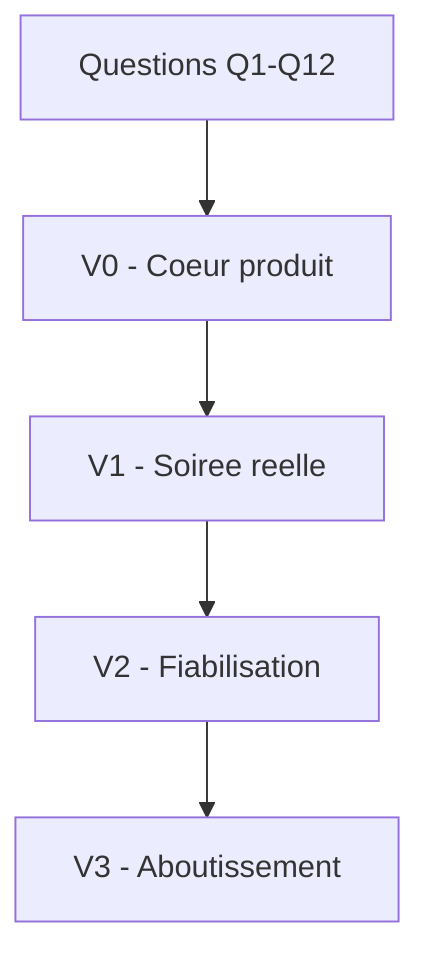
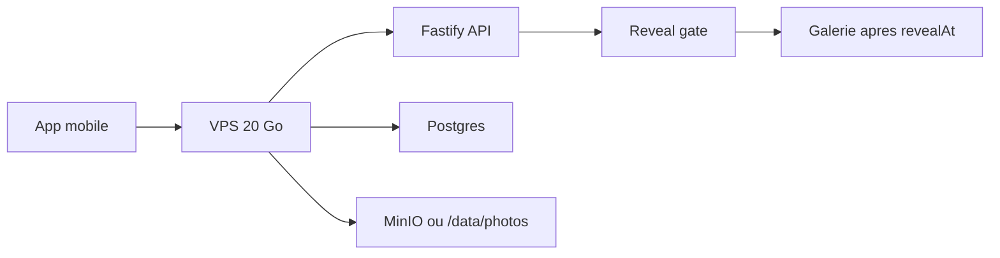
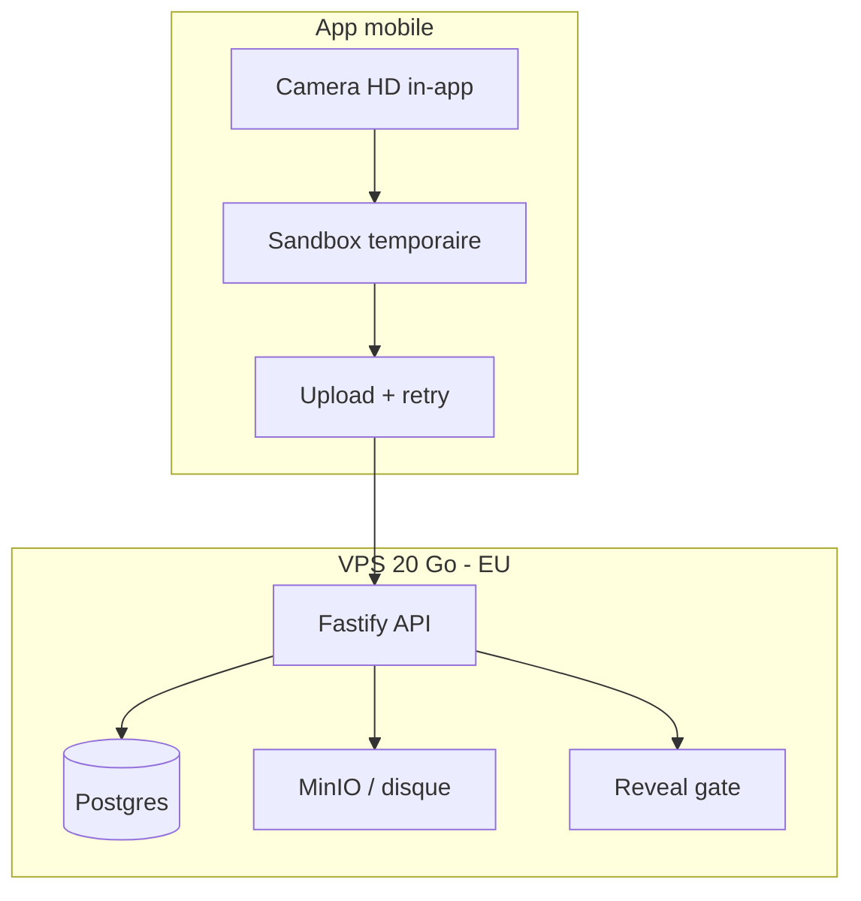
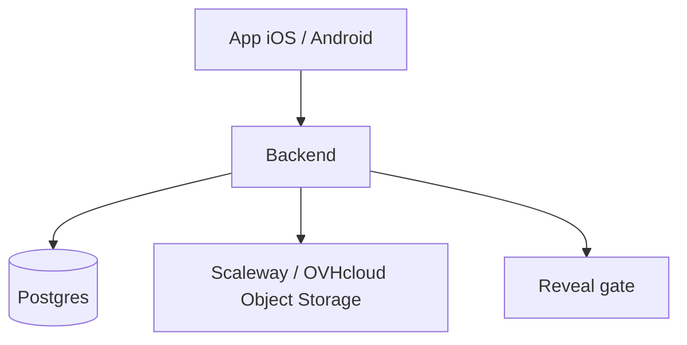
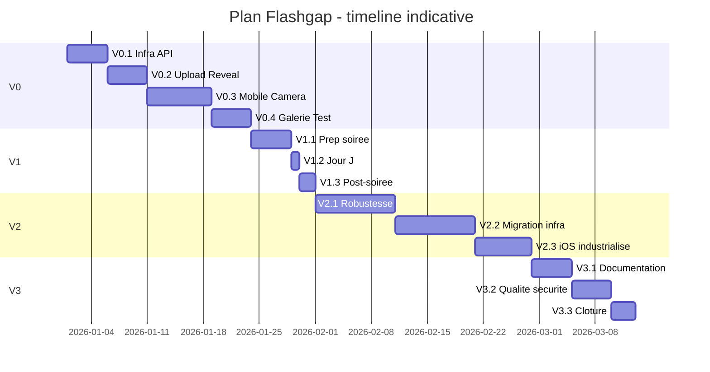

# Cadrage decisionnel — application type Flashgap

## Comment utiliser ce document

Ce document sert a **prendre des decisions une par une**, puis a en deduire un **plan de projet version par version** jusqu'a l'aboutissement.

### Methode

1. Lire la section **Invariants** (non negociables).
2. Repondre aux **questions dans l'ordre** (Q1 → Q12). Ne pas sauter une question tant que la precedente n'est pas tranchee.
3. Remplir le **registre des decisions** en bas de chaque question.
4. Une fois toutes les questions repondues, suivre le **plan detaille par version** (section 6).
5. Cocher les **criteres de sortie** de chaque etape avant de passer a la suivante.

### Vue d'ensemble des versions

| Version | Objectif | Public | Infra typique |
| --- | --- | --- | --- |
| **V0** | Valider le coeur produit de bout en bout | Toi + 1–3 testeurs | VPS 20 Go, mono-evenement |
| **V1** | Premiere vraie soiree | ~12 personnes | VPS ou migration partielle |
| **V2** | Fiabiliser, distribuer, operer | Reutilisation multi-evenements | Infra durable + CI |
| **V3** | Aboutissement projet | Usage ponctuel stabilise | Stack cible long terme |

---

## 1. Invariants produit (non negociables)

Ces points ne sont **pas remis en question** dans ce cadrage. Toute decision technique doit les respecter.

| Invariant | Description |
| --- | --- |
| Camera in-app | Les photos sont prises dans l'application, pas via l'appareil photo natif |
| Capture HD | Resolution elevee (12 MP+ ou equivalent appareil), JPEG qualite ~85–90 % |
| Pas de fuite galerie | Aucun enregistrement automatique dans Photos / Galerie systeme |
| Sandbox temporaire | Fichier local jusqu'a upload confirme, puis suppression |
| Reveal a heure fixe | Photos invisibles avant `revealAt`, galerie accessible apres |
| Upload fiable | Retry et reprise reseau obligatoires (fichiers lourds, reseau soiree) |
| Scope exclu | Pas de video, pas d'import galerie, pas de E2E, pas de moderation avancee |

> **Decision deja prise**
> La qualite HD in-app est un pilier produit. Les raccourcis se font ailleurs (infra, auth, CI, derivees image).

---

## 2. Contexte et ressources disponibles

| Ressource | Detail |
| --- | --- |
| VPS | 20 Go disque, a confirmer : hebergeur, region, RAM, CPU |
| Mac local | Developpement et builds iOS |
| GitHub | Depot code accepte |
| GitHub Actions | Accepte (niveau d'automatisation a decider) |
| Cible usage | Application ponctuelle, non commercialisee, ~12 personnes |
| Souverainete | Limitee aux **fichiers photo** ; metadonnees peuvent etre ailleurs |

### Budget disque (ordre de grandeur — decisions Q2 + Q7)

Hypothese retenue : 12 personnes, **>50 photos/personne** (plafond API **100**), JPEG HD ~4 Mo.

| Poste | Estimation |
| --- | --- |
| OS + Docker + Postgres + MinIO | ~3 Go |
| Photos brutes (12 × 100 × 4 Mo) | ~4,8 Go |
| Marge + logs | ~2 Go |
| **Total pire cas V1** | **~10 Go** — compatible VPS 20 Go pour un mono-evenement |

---

## 3. Parcours de decision — questions successives

Repondre dans l'ordre. Chaque question indique ce qu'elle debloque.

---

### Q1 — Quel est l'objectif de la premiere livraison ?

**Contexte** : La V0 sert a prouver le flux complet. La V1 sert a tenir une vraie soiree.

| Option | Description | Delai indicatif |
| --- | --- | --- |
| **A — V0 d'abord** | Valider capture HD → upload → countdown → reveal → galerie avec 1–3 testeurs | 2–4 semaines |
| **B — V1 directement** | Viser la soiree a 12 personnes sans phase intermediaire | 4–8 semaines |

**Recommandation** : **A — V0 d'abord**. Le VPS 20 Go et l'absence de CI au depart rendent une phase de validation interne indispensable.

**Debloque** : le niveau d'exigence des etapes V0.1 a V0.4.

**Ta decision**

| Champ | Valeur |
| --- | --- |
| Choix | [x] A — V0 d'abord &nbsp;&nbsp; [ ] B — V1 directement |
| Date cible premiere livraison | A definir |
| Notes | Valider le flux complet avant la soiree reelle |

---

### Q2 — Combien de participants pour la premiere soiree reelle (V1) ?

**Contexte** : Dimensionne stockage, bande passante et distribution mobile.

| Option | Impact |
| --- | --- |
| **A — ~12 personnes** | Hypothese initiale du projet |
| **B — Moins (6–8)** | Plus de marge disque/reseau, distribution iOS plus simple |
| **C — Plus (15–20)** | Revoir budget disque VPS ou migrer stockage avant V1 |

**Recommandation** : **A — ~12 personnes**, avec plafond soft de 50 photos/personne.

**Debloque** : Q8 (stockage), Q10 (Apple), estimations disque.

**Ta decision**

| Champ | Valeur |
| --- | --- |
| Choix | [x] A — ~12 personnes &nbsp;&nbsp; [ ] B &nbsp;&nbsp; [ ] C |
| Plafond photos/personne | [x] >50 — plafond API fixe a **100** |
| Notes | Attendre plus de 50 photos/personne ; surveiller disque VPS |

---

### Q3 — Quelle plateforme mobile en premier ?

**Contexte** : iOS et Android n'ont pas la meme friction de distribution. La camera HD fonctionne sur les deux, mais le chemin de test differe.

| Option | Avantages | Inconvenients |
| --- | --- | --- |
| **A — Android d'abord** | APK sideload facile, pas de compte Apple | Ne couvre pas les iPhones des invites |
| **B — iOS d'abord** | Valide tot tot le sujet camera + distribution Apple | Distribution limitee sans Developer Program |
| **C — Les deux des V0** | Couverture maximale | Double effort build/test des le depart |

**Recommandation** : **A — Android d'abord** pour V0, puis iOS des V0.4 ou V1 selon parc iPhone des invites.

**Debloque** : ordre des etapes mobile, moment de Q10.

**Ta decision**

| Champ | Valeur |
| --- | --- |
| Choix V0 | [ ] A &nbsp;&nbsp; [ ] B &nbsp;&nbsp; [x] C — Les deux (Android + iOS) |
| Choix V1 (soiree reelle) | [x] Android + iOS &nbsp;&nbsp; [ ] Android seul &nbsp;&nbsp; [ ] Autre |
| Notes | Double effort build/test des V0 ; Mac local requis pour iOS |

---

### Q4 — Stack mobile

**Contexte** : Le besoin cle est une app camera HD, pas un formulaire mobile.

| Option | Camera HD | Delai V0 | CI | Verdict |
| --- | --- | --- | --- | --- |
| **A — React Native bare + TypeScript** | Tres bon (`react-native-vision-camera`) | Moyen | Flexible | **Recommande** |
| **B — Expo (dev build) + TypeScript** | Bon (`expo-camera`) | Rapide | Plus contraint | Acceptable si equipe prefere Expo |
| **C — Flutter** | Bon | Moyen | Moyen | Si equipe Dart |
| **D — Natif iOS + Android** | Excellent | Long | Lourd | A ecarter pour ce projet |

**Recommandation** : **A — React Native bare + TypeScript** avec `react-native-vision-camera`.

**Debloque** : setup projet mobile, choix bibliotheque camera (Q5).

**Ta decision**

| Champ | Valeur |
| --- | --- |
| Choix | [ ] A &nbsp;&nbsp; [x] B — Expo dev build + TypeScript &nbsp;&nbsp; [ ] C &nbsp;&nbsp; [ ] D |
| Bibliotheque camera | [ ] react-native-vision-camera &nbsp;&nbsp; [x] expo-camera &nbsp;&nbsp; [ ] Autre |
| Notes | Dev build requis (pas Expo Go) pour camera HD en production |

---

### Q5 — Spec technique HD (a figer avant le dev mobile)

**Contexte** : "HD" doit etre defini precisement pour eviter les ecarts a l'implementation.

| Parametre | Recommandation V0 | Recommandation V1+ |
| --- | --- | --- |
| Resolution capture | Max supportee par l'appareil | Idem |
| Format | JPEG | JPEG |
| Qualite compression | 85–90 % | 85–90 % |
| Taille fichier cible | 3–6 Mo/photo | 3–6 Mo/photo |
| Orientation / EXIF | Conserver | Conserver |

**Recommandation** : Adopter le tableau tel quel. Pas de downscale avant upload.

**Debloque** : implementation camera, tests qualite image.

**Ta decision**

| Champ | Valeur |
| --- | --- |
| Qualite JPEG | [ ] 85 % &nbsp;&nbsp; [x] 90 % (defaut retenu) &nbsp;&nbsp; [ ] 100 % |
| Downscale avant upload | [x] Non &nbsp;&nbsp; [ ] Oui |
| Notes | Resolution max appareil, pas de reduction avant upload |

---

### Q6 — Architecture backend V0

**Contexte** : Un VPS 20 Go est disponible. Trois architectures possibles.

| Option | Description | Cout/mois | Effort | Verdict V0 |
| --- | --- | --- | --- | --- |
| **A — Tout sur VPS** | Fastify + Postgres + MinIO (ou disque) sur le VPS | VPS deja paye | Moyen | **Recommande V0** |
| **B — Supabase + Scaleway** | BaaS + stockage objet separe | ~30–40 USD + stockage | Faible | Recommande V1+ si migration |
| **C — Hybride** | API sur VPS, photos sur Scaleway des V0 | VPS + ~5 USD stockage | Moyen | Si souverainete photo stricte des V0 |

**Recommandation** : **A — Tout sur VPS** pour V0. Migration vers B ou C en V2 si besoin.

**Architecture V0 recommandee**

**Debloque** : setup infra, modele de donnees, flux upload.

**Ta decision**

| Champ | Valeur |
| --- | --- |
| Choix V0 | [x] A — Tout VPS &nbsp;&nbsp; [ ] B &nbsp;&nbsp; [ ] C |
| Choix cible V2+ | [x] Garder VPS (reévaluer si 2e evenement ou disque >60 %) &nbsp;&nbsp; [ ] Migrer Scaleway |
| Hbergeur / region VPS | A confirmer (region EU recommandee) |
| Notes | Fastify + Postgres + MinIO sur VPS 20 Go |

---

### Q7 — Stockage photos V0

**Contexte** : Les photos HD sont le poste disque principal. Le VPS a 20 Go.

| Option | Description | Souverainete EU | Simplicite V0 |
| --- | --- | --- | --- |
| **A — MinIO sur VPS** | Object storage S3-compatible local | Oui si VPS en EU | Tres bonne |
| **B — Dossier disque + API** | Fichiers dans `/data/photos`, servis via API | Oui si VPS en EU | Maximale |
| **C — Scaleway Object Storage** | Bucket S3 Paris des V0 | Oui | Moyenne (config externe) |

**Recommandation V0** : **A — MinIO** (facilite migration S3 vers Scaleway en V2). **B** acceptable si tu veux zero dependance MinIO.

**Regles communes** (toutes options)

- Bucket / repertoire **prive**
- Acces via **URLs signees** uniquement
- Pas d'URL publique directe

**Debloque** : implementation upload, signed URLs, purge post-evenement.

**Ta decision**

| Champ | Valeur |
| --- | --- |
| Choix V0 | [x] A — MinIO &nbsp;&nbsp; [ ] B &nbsp;&nbsp; [ ] C |
| Choix cible V2+ | [x] MinIO/VPS &nbsp;&nbsp; [ ] Scaleway &nbsp;&nbsp; [ ] OVHcloud |
| Politique purge post-evenement | [x] Manuelle &nbsp;&nbsp; [ ] Auto |
| Notes | Bucket prive, URLs signees |

---

### Q8 — Derivees image

**Contexte** : Le doc initial prevoit original + thumbnail + display. Chaque derivee multiplie stockage et code.

| Option | Stockage | UX galerie | Effort |
| --- | --- | --- | --- |
| **A — Original HD seul** | Minimal | Grille lente si 200+ photos | Minimal |
| **B — Original + thumbnail leger** | +~5 % | Grille fluide, tap = HD | Faible |
| **C — Original + thumb + display** | +~30–50 % | Optimal | Eleve |

**Recommandation** : **B — Original + thumbnail** des V0.4. En V0.1–V0.3, **A** suffit pour valider le flux.

**Debloque** : jobs de generation image cote backend.

**Ta decision**

| Champ | Valeur |
| --- | --- |
| V0 (validation flux) | [x] A — Original HD seul &nbsp;&nbsp; [ ] B |
| V1 (soiree reelle) | [x] A — Original HD seul &nbsp;&nbsp; [ ] B &nbsp;&nbsp; [ ] C |
| Taille thumbnail | N/A |
| Notes | Galerie charge les originaux ; perf a surveiller si 600+ photos |

---

### Q9 — Authentification et acces album

**Contexte** : Pour 12 personnes ponctuelles, l'auth peut rester minimale.

| Option | Description | Effort | Verdict |
| --- | --- | --- | --- |
| **A — Code album + pseudo** | L'organisateur cree l'album, partage un code, l'invite choisit un pseudo | Minimal | **Recommande V0–V1** |
| **B — Code + PIN par invite** | Controle d'acces renforce | Faible | Si inquietude sur le code partage |
| **C — Comptes email/mot de passe** | Auth classique | Eleve | Reporter V2+ |

**Recommandation** : **A** pour V0 et V1.

**Debloque** : modele `albums`, `memberships`, endpoints join.

**Ta decision**

| Champ | Valeur |
| --- | --- |
| Choix V0/V1 | [x] A — Code album + pseudo &nbsp;&nbsp; [ ] B &nbsp;&nbsp; [ ] C |
| Longueur code album | [x] 6 caracteres (defaut retenu) &nbsp;&nbsp; [ ] 8 |
| Notes | Pas de compte utilisateur |

---

### Q10 — Distribution iPhone (Apple Developer Program)

**Contexte** : Le point dur iOS n'est pas le code, c'est la **distribution a ~12 iPhones**.

| Option | Sans abonnement 99 EUR/an | Confort 12 iPhones | Quand |
| --- | --- | --- | --- |
| **A — Xcode + Personal Team** | Oui (dev + 1–2 appareils) | Faible | V0 uniquement |
| **B — Developer Program + TestFlight** | Non | Excellent | **Avant V1 si parc iPhone** |
| **C — Developer Program + Ad Hoc** | Non | Bon (parc controle) | Alternative a TestFlight |

**Recommandation** : **A** pendant V0. **B (TestFlight)** obligatoire avant V1 si des iPhones participent a la soiree.

**Debloque** : date d'inscription Apple, planning V1.

**Ta decision**

| Champ | Valeur |
| --- | --- |
| Methode V0 | [x] A — Xcode local (Personal Team) |
| Methode V1 | [x] A — Xcode local (meme choix) — **voir alerte ci-dessous** |
| Date inscription Apple (si B ou C) | Non prevue pour l'instant |
| Notes | Limite : ~1–2 iPhones par build sans Developer Program |

> **Alerte Q10 — A trancher avant V1**
> Avec **~12 iPhones** et **Xcode seul**, la distribution confortable n'est **pas realiste**. Options avant la soiree :
> 1. Souscrire au **Apple Developer Program** + **TestFlight** (recommande)
> 2. Installer manuellement sur chaque iPhone via Xcode (lourd, appareils physiques requis)
> 3. Reduire le parc iPhone a la V1
>
> Decision V1 iOS a prendre en fin de V0.4.

---

### Q11 — CI/CD et qualite code

**Contexte** : La CI accelere la livraison mais peut devenir un projet a part.

| Niveau | Contenu | Quand |
| --- | --- | --- |
| **0 — Aucune CI** | Builds locaux uniquement | **V0** (recommande) |
| **1 — CI backend** | Lint + tests API sur GitHub Actions | V0.4 ou V1 |
| **2 — CI backend + Android** | + build APK/AAB automatique | V1 |
| **3 — CI complete** | + self-hosted runner iOS sur Mac | V2 |

**Recommandation** : Niveau **0** en V0, niveau **1–2** en V1, niveau **3** seulement si builds iOS repetitifs.

**Debloque** : setup GitHub Actions, scripts de build.

**Ta decision**

| Champ | Valeur |
| --- | --- |
| Niveau V0 | [x] 0 — Aucune CI &nbsp;&nbsp; [ ] 1 |
| Niveau V1 | [x] 0 — Aucune CI &nbsp;&nbsp; [ ] 1 &nbsp;&nbsp; [ ] 2 |
| Niveau V2 | [ ] 2 &nbsp;&nbsp; [ ] 3 — a trancher en V2 |
| Notes | Builds locaux (Mac + Android Studio) |

---

### Q12 — Sauvegardes et reprise (V1 minimum)

**Contexte** : Un VPS mono-noeud sans backup = risque de perte totale des photos de la soiree.

| Option | Description | Quand |
| --- | --- | --- |
| **A — Snapshot VPS hebergeur** | Backup disque complet | Avant V1 (minimum) |
| **B — Export Postgres + sync photos** | Dump SQL + rsync vers stockage externe | V1 |
| **C — Pas de backup V0** | Acceptable pour tests internes | V0 seulement |

**Recommandation** : **C** acceptable en V0. **A + B** obligatoires avant V1.

**Debloque** : runbook operationnel, checklist pre-soiree.

**Ta decision**

| Champ | Valeur |
| --- | --- |
| V0 | [x] C — Pas de backup |
| V1 | [x] Pas de backup (choix explicite) — **risque accepte** |
| Notes | Revoir avant V1 si les photos de la soiree doivent etre protegees |

---

## 4. Synthese des decisions — registre global

Decisions validees le **2026-06-02**.

| # | Decision | Choix retenu | Date |
| --- | --- | --- | --- |
| Q1 | Premiere livraison | V0 d'abord — valider le flux | 2026-06-02 |
| Q2 | Participants V1 | ~12 personnes, >50 photos/pers. (plafond API 100) | 2026-06-02 |
| Q3 | Plateforme(s) | V0: Android + iOS / V1: Android + iOS | 2026-06-02 |
| Q4 | Stack mobile | Expo dev build + TypeScript + expo-camera | 2026-06-02 |
| Q5 | Spec HD | JPEG 90 %, pas de downscale, resolution max appareil | 2026-06-02 |
| Q6 | Backend V0 / cible V2 | Tout sur VPS / Garder VPS en V2+ (reévaluer) | 2026-06-02 |
| Q7 | Stockage photos | MinIO sur VPS / purge manuelle | 2026-06-02 |
| Q8 | Derivees image | Original HD seul (V0 et V1) | 2026-06-02 |
| Q9 | Auth | Code album 6 car. + pseudo | 2026-06-02 |
| Q10 | Distribution iOS | Xcode local (V0 et V1 provisoire — alerte 12 iPhones) | 2026-06-02 |
| Q11 | CI/CD | Niveau 0 (V0 et V1), V2 a trancher | 2026-06-02 |
| Q12 | Sauvegardes | Pas de backup (V0 et V1) | 2026-06-02 |

### Stack retenue (apres decisions)

| Brique | V0 | V1 | V2+ |
| --- | --- | --- | --- |
| Mobile | Expo dev build + expo-camera | Idem | Idem + CI optionnelle |
| Backend | Fastify sur VPS | Idem | + rate limiting, CI |
| Base | Postgres (Docker) | Idem | Idem |
| Photos | MinIO (bucket prive, URLs signees) | Idem | Migration Scaleway si besoin |
| Auth | Code album + pseudo | Idem | Idem |
| CI | Aucune | Aucune | A trancher |
| iOS distribution | Xcode local | Xcode (TestFlight a decider) | TestFlight recommande |

### Points ouverts (a trancher en fin de V0)

| Sujet | Urgence | Recommandation |
| --- | --- | --- |
| Distribution 12 iPhones (Q10) | Avant V1 | TestFlight + Apple Developer Program |
| Sauvegardes soiree (Q12) | Avant V1 | Snapshot VPS minimum malgre choix initial |
| Hbergeur / region VPS | Avant V0.1 | Region EU |
| Thumbnails galerie (Q8) | Apres V1 si perf degradee | Original + thumb 400 px |

---

## 5. Architecture cible par phase

### V0 — Tout sur VPS (recommandation par defaut)

### V2+ — Migration optionnelle

La migration V0 → V2 se fait sans changer le contrat mobile si l'API REST reste stable et que MinIO/Scaleway restent S3-compatibles.

---

## 6. Plan detaille par version

### Legende

- **Livrable** : ce qui existe a la fin de l'etape
- **Critere de sortie** : condition pour passer a l'etape suivante
- **Duree** : estimation solo dev, a ajuster

---

### V0 — Valider le coeur produit

Objectif : prouver **capture HD → upload → countdown → reveal → galerie** sur **Android et iOS** avec 1–3 testeurs.

#### V0.1 — Fondations infra et API (3–5 jours)

| # | Tache | Detail |
| --- | --- | --- |
| 1 | Provisionner VPS | OS, firewall, utilisateur deploy, region EU |
| 2 | Docker Compose | Postgres, MinIO (ou volume photos), API Fastify |
| 3 | Modele de donnees | `albums`, `members`, `photos`, `reveal_at` |
| 4 | Endpoints CRUD album | Creer album, rejoindre par code, definir `reveal_at` |
| 5 | HTTPS | Reverse proxy (Caddy ou Nginx + Let's Encrypt) |

**Livrables** : API deployee, swagger ou collection HTTP, album creatable via API.

**Criteres de sortie**

- [ ] `POST /albums` cree un album avec code unique
- [ ] `POST /albums/:code/join` ajoute un membre avec pseudo
- [ ] `reveal_at` modifiable par l'organisateur
- [ ] HTTPS fonctionnel

---

#### V0.2 — Upload photo et reveal gate (3–5 jours)

| # | Tache | Detail |
| --- | --- | --- |
| 1 | Upload multipart | `POST /albums/:id/photos`, JPEG HD, max size configurable |
| 2 | Stockage prive | Ecriture MinIO/disque, cle objet par album |
| 3 | Reveal gate | Endpoints photos retournent 403 avant `reveal_at` |
| 4 | URLs signees | Generation URLs temporaires apres reveal |
| 5 | Quota | Plafond **100 photos/membre** (cf. Q2) |

**Livrables** : upload curl/Postman fonctionnel, photos inaccessibles avant reveal.

**Criteres de sortie**

- [ ] Upload JPEG 5 Mo OK
- [ ] Avant `reveal_at` : liste photos vide ou 403
- [ ] Apres `reveal_at` : URLs signees valides
- [ ] Quota enforce cote API

---

#### V0.3 — App mobile : camera et upload (6–10 jours)

| # | Tache | Detail |
| --- | --- | --- |
| 1 | Init projet Expo | Dev build (`expo prebuild`), TypeScript |
| 2 | Ecran join | Saisie code album + pseudo |
| 3 | Camera HD | `expo-camera`, resolution max, JPEG 90 %, spec Q5 |
| 4 | Sandbox | Fichier temporaire, pas de save galerie (`MediaLibrary` desactive) |
| 5 | Upload + retry | Queue locale, retry exponential backoff |
| 6 | UI countdown | Afficher temps restant avant reveal |
| 7 | Builds plateformes | APK Android + build iOS via Xcode (Personal Team) |

**Livrables** : APK Android + build iOS installables, flux join → capture → upload.

**Criteres de sortie**

- [ ] Photo capturee en HD sur Android **et** iOS (verifier metadonnees taille/resolution)
- [ ] Photo absente de la galerie systeme
- [ ] Upload reussit sur reseau 4G/WiFi
- [ ] Retry automatique apres coupure reseau
- [ ] Countdown visible et correct

---

#### V0.4 — Galerie et test bout en bout (3–5 jours)

| # | Tache | Detail |
| --- | --- | --- |
| 1 | Ecran galerie | Grille photos (originaux HD), etat "verrouille" avant reveal |
| 2 | Reveal automatique | Rafraichissement a `reveal_at` (poll simple) |
| 3 | Test multi-appareils | 2–3 telephones **Android + iOS**, 1 album, 1 reveal |
| 4 | Purge test | Script suppression album + photos |
| 5 | Go/no-go V1 | Trancher Q10 (TestFlight?) et Q12 (backup?) |

**Livrables** : demo complete filmable, runbook test interne.

**Criteres de sortie**

- [ ] 2+ appareils (Android **et** iOS) dans le meme album
- [ ] Photos visibles simultanement apres reveal
- [ ] Qualite HD confirmee visuellement
- [ ] Purge remet le disque a un etat propre

**Fin V0** : le coeur produit est valide. Decision go/no-go pour V1.

---

### V1 — Premiere vraie soiree (~12 personnes)

Objectif : tenir une soiree reelle sans perte de photos ni blocage distribution.

#### V1.1 — Preparer la soiree (3–5 jours)

| # | Tache | Detail |
| --- | --- | --- |
| 1 | iOS build | Xcode local — **decider TestFlight avant Jour J si 12 iPhones** |
| 2 | Android APK | Build release signe (`eas build` local ou Gradle), distribution fichier |
| 3 | Monitoring minimal | Logs API, alerte disque > 80 % (pas de backup — risque accepte) |
| 4 | Runbook soiree | Doc : creer album, distribuer app, heure reveal, que faire si panne |
| 5 | Test charge leger | 12 uploads simultanes simules, ~100 photos/personne en estimation |

**Criteres de sortie**

- [ ] App installable sur tous les appareils cibles (Android APK + iOS via Xcode ou TestFlight)
- [ ] Runbook relu
- [ ] Espace disque > 8 Go libre (budget ~10 Go pire cas)
- [ ] Decision Q10 iOS tranchee pour les 12 iPhones

---

#### V1.2 — Soiree (Jour J)

| # | Tache | Detail |
| --- | --- | --- |
| 1 | Creer album | Organisateur definit `reveal_at` |
| 2 | Distribuer code + app | Code album communique aux invites |
| 3 | Surveiller | Disque, erreurs upload, latence API |
| 4 | Reveal | Verifier galerie accessible pour tous |
| 5 | Export post-soiree | Archive photos pour participants (optionnel) |

**Criteres de sortie**

- [ ] Taux upload reussi > 95 %
- [ ] Reveal a l'heure pour tous
- [ ] Aucune fuite photo avant reveal
- [ ] Retour utilisateurs collecte

---

#### V1.3 — Post-soiree (1–2 jours)

| # | Tache | Detail |
| --- | --- | --- |
| 1 | Debrief | Bugs, friction UX, perf reseau |
| 2 | Purge ou archivage | Selon Q7 |
| 3 | Liste corrections | Prioriser pour V2 |

**Fin V1** : premiere soiree tenue. Decision go/no-go pour V2.

---

### V2 — Fiabiliser et operer

Objectif : rendre le systeme **reutilisable** pour d'autres evenements sans repartir de zero.

#### V2.1 — Robustesse (1–2 semaines)

| # | Tache | Detail |
| --- | --- | --- |
| 1 | CI backend (Q11) | Lint, tests, deploy automatique |
| 2 | CI Android | Build APK sur tag |
| 3 | Thumbnails (optionnel) | Si galerie lente avec 600+ originaux HD |
| 4 | Gestion erreurs mobile | Etats offline, file d'attente persistante |
| 5 | Rate limiting API | Protection upload abusif |

---

#### V2.2 — Migration infra optionnelle (1–2 semaines)

| # | Tache | Detail |
| --- | --- | --- |
| 1 | Evaluer disque VPS | Si multi-evenements : migrer photos vers Scaleway/OVH |
| 2 | Script migration MinIO → Scaleway | S3-compatible, zero downtime si possible |
| 3 | Separer metadonnees / photos | Documenter gouvernance souverainete |
| 4 | Lifecycle rules | Purge auto photos apres X jours |

**Declencheur migration** : second evenement prevu OU disque VPS > 60 % utilise.

---

#### V2.3 — iOS industrialise (si necessaire)

| # | Tache | Detail |
| --- | --- | --- |
| 1 | TestFlight stable | Builds reguliers |
| 2 | Self-hosted runner (option) | Automatisation build iOS sur Mac |
| 3 | Test sur 12 iPhones | Beta pre-evenement |

**Fin V2** : stack operable pour plusieurs evenements.

---

### V3 — Aboutissement projet

Objectif : livrer un produit **stable, documente, transferable** (meme si non commercialise).

#### V3.1 — Documentation et transfert

| # | Tache | Detail |
| --- | --- | --- |
| 1 | README complet | Setup local, deploy, build mobile |
| 2 | Architecture doc | Schema infra, flux upload/reveal, modele donnees |
| 3 | Runbook operationnel | Creer evenement, backup, restore, purge |
| 4 | Decision log | Ce document + registre rempli |

---

#### V3.2 — Qualite et securite

| # | Tache | Detail |
| --- | --- | --- |
| 1 | Audit securite basique | HTTPS, secrets, signed URLs, quotas |
| 2 | Tests automatises | Parcours critique couvert |
| 3 | Performance galerie | 200+ photos, scroll fluide |

---

#### V3.3 — Cloture

| # | Tache | Detail |
| --- | --- | --- |
| 1 | Dernier evenement pilote | Validation V3 en conditions reelles |
| 2 | Archivage code + infra | Tag release finale |
| 3 | Retrospective | Lessons learned |

**Fin V3** : projet abouti, utilisable ponctuellement sans toi au quotidien.

---

## 7. Timeline indicative

Estimation solo, a ajuster apres Q1–Q12.

| Phase | Duree estimee | Prerequis |
| --- | --- | --- |
| V0 complet | 4–5 semaines | Decisions Q1–Q12 validees |
| V1 | 1 semaine + soiree | V0 valide, **Q10 iOS tranchee** |
| V2 | 3–4 semaines | V1 debriefee |
| V3 | 2 semaines | V2 stable |

---

## 8. Checklist pre-soiree (V1)

A imprimer / cocher avant le Jour J.

- [ ] Registre des decisions (section 4) complete
- [ ] VPS : espace disque > 8 Go libre
- [ ] App installee sur tous les appareils cibles (Android + iOS)
- [ ] APK Android + build iOS distribues et testes
- [ ] Decision iOS V1 prise (Xcode manuel vs TestFlight)
- [ ] Album cree, `reveal_at` confirme avec l'organisateur
- [ ] Code album communique
- [ ] Quota rappelle aux invites (>50 photos OK, plafond 100)
- [ ] Plan B si VPS down (hotspot + retry upload)
- [ ] Contact support technique identifie pendant la soiree

---

## 9. Risques et mitigations

| Risque | Impact | Mitigation | Phase |
| --- | --- | --- | --- |
| Disque VPS plein (>100 photos/pers.) | Perte uploads | Quota 100, alerte 80 %, purge | V0+ |
| Reseau soiree instable | Uploads echoues | Retry + queue offline | V0.3 |
| Distribution iOS bloquee (12 iPhones, Xcode seul) | iPhones exclus | **TestFlight avant V1** | V1 |
| Photos avant reveal | Confiance cassee | Reveal gate API + tests | V0.2 |
| Panne VPS sans backup | Perte totale photos | Revoir Q12 avant V1 | V1 |
| Galerie lente (originaux HD seuls) | UX degradee | Thumbnails en V2 si besoin | V1+ |
| Qualite HD insuffisante | Produit degrade | Spec Q5 + tests metadonnees | V0.3 |

---

## 10. Prochaine action

**Decisions Q1–Q12 validees le 2026-06-02.** Demarrer **V0.1 — Fondations infra et API**.

Checklist immediate :

1. Confirmer **hebergeur et region EU** du VPS
2. Provisionner le VPS (Docker, firewall, HTTPS)
3. Deployer Postgres + MinIO + Fastify (Docker Compose)
4. Implementer endpoints album (code 6 car. + pseudo)

A trancher en fin de V0.4 : **distribution iOS pour 12 iPhones** (TestFlight recommande malgre choix Xcode initial).

---

## Sources officielles

### Apple

- Apple Developer Program : https://developer.apple.com/programs/enroll/
- TestFlight : https://developer.apple.com/help/app-store-connect/test-a-beta-version/testflight-overview/
- Ad Hoc provisioning : https://developer.apple.com/help/account/provisioning-profiles/create-an-ad-hoc-provisioning-profile
- Personal Team : https://developer.apple.com/library/archive/qa/qa1915/_index.html

### Mobile

- Expo documentation : https://docs.expo.dev/
- Expo dev builds : https://docs.expo.dev/develop/development-builds/introduction/
- expo-camera : https://docs.expo.dev/versions/latest/sdk/camera/

### Infra

- MinIO : https://min.io/docs/minio/linux/index.html
- Scaleway Object Storage : https://www.scaleway.com/en/pricing/storage/
- OVHcloud Object Storage : https://www.ovhcloud.com/en/public-cloud/object-storage/

### CI

- GitHub Actions : https://docs.github.com/actions
- Self-hosted runners : https://docs.github.com/actions/hosting-your-own-runners

### Notes

- Les couts et durees sont des ordres de grandeur.
- Les prix cloud et politiques Apple doivent etre reverifies avant engagement.
