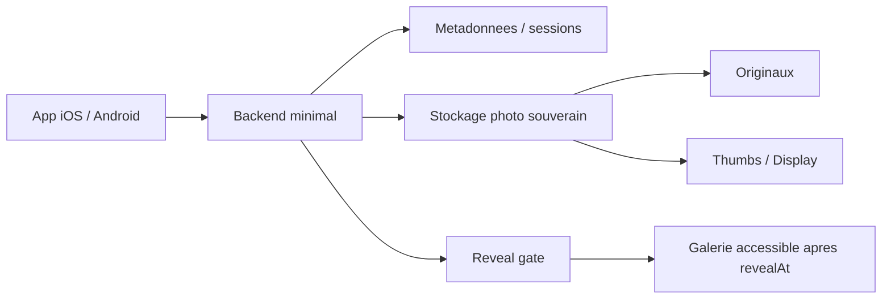

# Cadrage decisionnel pour une application type Flashgap

## 1. Resume executif

Ce document ne specifie pas l'implementation de l'application. Il sert a choisir rapidement une direction produit et technique pour une v1 utilisee ponctuellement, non commercialisee, par environ `12 personnes`.

Le cadre retenu est le suivant:

- application `iOS + Android`
- photos prises `dans l'app`, en `haute definition`
- photos `non visibles avant une heure d'ouverture`
- `souverainete limitee aux photos`
- `GitHub` et `GitHub Actions` acceptes
- `Mac local` disponible pour developper et construire l'app iOS
- decision `Apple Developer Program` encore ouverte

La recommandation provisoire est:

1. partir sur `React Native bare + TypeScript`
2. prendre `Supabase` pour le backend minimal et les metadonnees
3. stocker toutes les `photos` sur `Scaleway Object Storage` en region `Paris`
4. developper iOS au debut avec `Xcode` sur le `Mac local`
5. reporter la decision `Apple Developer Program` jusqu'au premier vrai test multi-appareils
6. utiliser `GitHub Actions` pour lint, tests, builds Android et checks backend
7. n'automatiser les builds iOS qu'en second temps, soit depuis le Mac local, soit via `self-hosted runner`

> **Recommandation**
> La combinaison la plus pragmatique pour une v1 ponctuelle est `React Native bare + Supabase + Scaleway Object Storage`.

> **Pourquoi**
> C'est la combinaison qui minimise le temps de delivery tout en gardant les photos sur un stockage europeen compatible S3, sans imposer un backend custom trop lourd.

> **Risques**
> Les metadonnees ne seront pas souveraines. La distribution iPhone restera le vrai point bloquant tant que le choix Apple n'est pas tranche.

> **Decision a reporter**
> Le `Apple Developer Program` peut etre differe pendant la phase de cadrage et de prototype, mais il devient bloquant avant un vrai test sur `12 iPhones`.

---

## 2. Hypotheses produit

### Perimetre produit v1

- un organisateur cree un `album-soiree`
- les invites rejoignent via un `code`
- les photos sont prises `dans l'application`
- chaque photo est uploadee vers un stockage partage
- les photos restent invisibles jusqu'a `l'heure d'ouverture`
- une fois l'heure atteinte, tous les participants peuvent consulter la galerie

### Hypotheses structurantes

- la capture se fait avec une `camera integree a l'app`, pas via l'appareil photo natif
- les photos ne sont `pas enregistrees dans Photos / Galerie`
- elles sont en revanche conservees temporairement dans le `sandbox prive de l'application` pour gerer l'upload, la reprise reseau et les erreurs
- la souverainete vise uniquement les `fichiers photo`; les metadonnees applicatives peuvent etre hebergees ailleurs
- la v1 ne repose pas sur du `chiffrement de bout en bout`
- la v1 ne cherche pas a couvrir la video, l'edition, la moderation avancee ou la montee en charge industrielle

> **Recommandation**
> Conserver un scope v1 tres serre: capture photo HD, upload fiable, countdown, reveal, galerie.

> **Pourquoi**
> Toute extension prematuree sur la video, l'import galerie ou des comptes riches augmente fortement la complexite mobile et backend.

---

## 3. Matrice des choix mobile

### Echelle de notation

Tous les scores ci-dessous vont de `1` a `5`, avec `5 = le plus favorable`.

- `Cout`: moins couteux a construire et maintenir
- `Rapidité`: plus rapide a mettre en place
- `Complexite`: plus simple techniquement
- `UX`: meilleur potentiel d'experience utilisateur
- `Portabilite`: plus facile a faire evoluer ou migrer

### Comparatif

| Option | Cout | Rapidite | Complexite | UX | Portabilite | Camera HD / natif | CI mobile | Commentaire |
| --- | ---: | ---: | ---: | ---: | ---: | --- | --- | --- |
| React Native bare | 4 | 5 | 4 | 4 | 4 | Tres bon avec bibliotheques natives | Moyenne | Meilleur compromis pour une v1 rapide avec besoin camera avance |
| Flutter | 4 | 4 | 3 | 4 | 4 | Bon, mais integrer finement certaines briques natives peut prendre plus de temps | Moyenne | Solide, mais moins naturel si l'equipe pense deja en stack JS/backend web |
| Natif iOS + Android | 1 | 1 | 1 | 5 | 3 | Excellent | Lourde | UX maximale, mais cout et delai disproportionnes pour une v1 a 12 personnes |

### Lecture orientee decision

| Critere important pour ce projet | React Native bare | Flutter | Natif |
| --- | --- | --- | --- |
| Aller vite a deux plateformes | Oui | Oui | Non |
| Integrer une camera in-app serieuse | Oui | Oui | Oui |
| Garder une seule base produit | Oui | Oui | Non |
| Rester flexible si du natif est necessaire | Oui | Partiellement | Oui |
| Limiter le cout d'une v1 ponctuelle | Oui | Oui | Non |

> **Recommandation**
> Choisir `React Native bare + TypeScript`.

> **Pourquoi**
> Pour ce projet, le besoin cle n'est pas un simple formulaire mobile: c'est une `app camera`. `React Native bare` garde la souplesse du natif tout en restant rapide a livrer sur iOS et Android. C'est mieux aligne qu'une app Expo geree si l'on veut rester libre sur la partie build, camera et CI.

> **Risques**
> Il faut assumer des dossiers natifs iOS et Android, donc une CI plus proche d'un vrai projet mobile que d'une web app.

> **Decision a reporter**
> Le choix de la bibliotheque camera precise peut etre reporte apres ce cadrage, mais la direction `React Native bare` doit etre tranchee maintenant.

### Position sur la camera

Pour une app de ce type, la ligne directrice a retenir est:

- `camera in-app`
- `capture haute definition`
- `pas d'enregistrement automatique dans la galerie`
- `stockage temporaire en sandbox`

Cela permet de garder le controle sur:

- la qualite de capture
- le moment de l'upload
- la confidentialite avant reveal
- la non-persistance dans la pellicule systeme

---

## 4. Matrice backend

### Comparatif de haut niveau

| Option | Donnees souveraines | Donnees non souveraines | Cout d'entree | Effort de build | Lock-in | Portabilite | Observabilite | UX attendue | Verdict |
| --- | --- | --- | --- | --- | --- | --- | --- | --- | --- |
| Supabase + stockage photo souverain | Photos | Auth, DB, sessions, metadonnees, fonctions | Moyen | Faible | Moyen | Moyen | Bonne | Tres bonne | Recommande |
| Node/Fastify + Railway + stockage photo souverain | Photos | DB, sessions, metadonnees, logs | Faible a moyen | Moyen a eleve | Faible a moyen | Bonne | A construire | Bonne | Repli recommande |
| Cloudflare Workers/D1 + stockage photo souverain | Photos | D1, sessions, logique API | Faible | Moyen | Moyen | Moyenne | Bonne | Bonne | Technique mais pas prioritaire |
| Firebase + stockage photo souverain | Photos | Presque tout le reste | Faible | Faible | Fort | Faible | Tres bonne | Tres bonne | Rapide mais a eviter ici |

### Comparatif note 1 a 5

| Option | Cout | Rapidite | Complexite | Souverainete photos | UX | Portabilite | Commentaire |
| --- | ---: | ---: | ---: | ---: | ---: | ---: | --- |
| Supabase + Scaleway/OVH photos | 4 | 5 | 4 | 5 | 5 | 3 | Le plus pragmatique |
| Node/Fastify + Railway + stockage photo souverain | 3 | 3 | 2 | 5 | 4 | 5 | Plus de controle, plus de code |
| Cloudflare + stockage photo souverain | 4 | 3 | 3 | 5 | 4 | 3 | Bien si on veut plus serverless et plus custom |
| Firebase + stockage photo souverain | 4 | 5 | 5 | 5 | 5 | 2 | Le plus rapide, mais lock-in fort |

### Detail par option

#### Option A - Supabase + stockage photo souverain

- `Souverain`: originaux photo, thumbs, derives d'affichage sur `Scaleway` ou `OVHcloud`
- `Non souverain`: base, auth, sessions, albums, memberships, eventuels logs sur `Supabase`
- `Ordre de grandeur de cout`: environ `25 USD/mois` et plus selon usage pour un projet payant, plus le cout du stockage photo
- `Niveau d'effort`: faible
- `Points forts`: Postgres gere, auth, edge functions, dashboard, vitesse de mise en place
- `Points faibles`: BaaS central, portabilite moyenne, metadonnees hors souverainete europeenne stricte

#### Option B - Node/Fastify + Railway + stockage photo souverain

- `Souverain`: originaux photo, thumbs, derives sur `Scaleway` ou `OVHcloud`
- `Non souverain`: API, Postgres, secrets, logs sur `Railway`
- `Ordre de grandeur de cout`: environ `5 a 30 USD/mois` selon abonnement et ressources, plus le stockage photo
- `Niveau d'effort`: moyen a eleve
- `Points forts`: meilleur controle, meilleure portabilite, backend plus classique
- `Points faibles`: plus de code a ecrire, plus d'observabilite a assembler, time-to-market plus lent

#### Option C - Cloudflare Workers/D1 + stockage photo souverain

- `Souverain`: photos sur `Scaleway` ou `OVHcloud`
- `Non souverain`: D1, logique serverless, logs et controle d'acces sur `Cloudflare`
- `Ordre de grandeur de cout`: a partir d'environ `5 USD/mois` pour Workers Paid, puis usage
- `Niveau d'effort`: moyen
- `Points forts`: faible ops, faible cout initial, bon modele serverless
- `Points faibles`: plus technique pour les workflows photo, plus de logique custom, persistance moins confortable qu'un vrai Postgres

#### Option D - Firebase + stockage photo souverain

- `Souverain`: photos si elles sont sorties de Firebase Storage vers un stockage europeen separe
- `Non souverain`: auth, DB, fonctions, analytics, logs sur `Google`
- `Ordre de grandeur de cout`: tres faible au depart, puis variable selon usage
- `Niveau d'effort`: faible
- `Points forts`: excellent DX mobile, auth et temps reel tres rapides a assembler
- `Points faibles`: lock-in fort, peu aligne avec l'objectif de bien separer les photos du reste et de garder une architecture reversible

> **Recommandation**
> Choisir `Supabase + stockage photo souverain`.

> **Pourquoi**
> Le projet a besoin d'un backend `petit`, pas d'une plateforme backend a construire pendant des semaines. Supabase couvre vite la base, l'auth legere, les metadonnees et quelques endpoints. Le besoin de souverainete etant limite aux photos, le compromis est tres bon.

> **Option de repli**
> Si vous voulez reduire la dependance a un BaaS et accepter plus de travail backend, prendre `Node/Fastify + Railway + stockage photo souverain`.

> **Risques**
> Avec Supabase, la separation entre `fichiers photo souverains` et `metadonnees non souveraines` doit etre explicite et bien documentee.

---

## 5. Matrice stockage photo souverain

### Hypothese de choix

Le stockage photo doit repondre a quatre besoins:

- juridiction et hebergement europeens
- compatibilite `S3`
- prix simple
- mise en oeuvre rapide avec une petite equipe

### Comparatif

| Option | Juridiction / image | Region utile | Compatibilite S3 | Stockage | Egress | Simplicite | Lifecycle rules | Derives image | Verdict |
| --- | --- | --- | --- | --- | --- | --- | --- | --- | --- |
| Scaleway Object Storage Multi-AZ | Europeen, image forte de souverainete | Paris | Oui | `€0.0146/GB/mois` | `75 GB` inclus puis `€0.01/GB` | Tres bonne | Oui | A faire cote backend | Recommande |
| OVHcloud Object Storage 3-AZ | Europeen, discours fort sur la souverainete | Europe | Oui | ~`$0.0158/GiB/mois` en 3-AZ | Inclus | Bonne | Oui | A faire cote backend | Tres credible |

### Lecture orientee decision

| Critere | Scaleway | OVHcloud |
| --- | --- | --- |
| Stockage photo souverain en Europe | Oui | Oui |
| Integration simple avec backend web/mobile | Oui | Oui |
| Prix lisible pour petite volumetrie | Oui | Oui |
| Egress favorable si forte consultation | Correct | Tres favorable |
| Simplicite pour une v1 a Paris | Tres bonne | Bonne |

### Choix recommande

> **Recommandation**
> Choisir `Scaleway Object Storage Multi-AZ` en region `Paris` pour la v1.

> **Pourquoi**
> Le prix de stockage est competitif, `75 GB` d'egress mensuel sont inclus, l'integration S3 est simple, et la region `Paris` cadre bien avec un usage evenementiel local. Pour une premiere version a petite echelle, c'est l'option la plus simple a operer.

> **Risques**
> Si la consultation des photos ou les telechargements deviennent plus importants que prevu, `OVHcloud` peut devenir plus interessant grace a l'egress public inclus.

> **Decision a reporter**
> Le choix `Scaleway vs OVHcloud` peut encore etre affinee au moment d'estimer le vrai volume photo et le comportement de consultation apres reveal.

### Position sur les derives image

Dans les deux cas:

- stocker l'`original`
- generer un `thumbnail`
- generer une version `display`
- garder le bucket prive
- n'exposer que des `URLs signees`

Le service de stockage ne remplace pas la logique applicative de reveal. Celle-ci reste du cote backend.

---

## 6. Distribution iPhone

### Ce qu'il faut comprendre tout de suite

Le point dur n'est pas de `coder` l'app iOS. Le point dur est de la `distribuer proprement` a environ `12 iPhones`.

### Comparatif

| Option | Faisable sans abonnement | Confort de distribution | Adaptation a 12 iPhones | Delai | Commentaire |
| --- | --- | --- | --- | --- | --- |
| Xcode local + Personal Team | Oui, pour developper et tester sur appareil | Faible | Faible | Court | Bien pour developper maintenant, pas pour une vraie diffusion fluide |
| Apple Developer Program + TestFlight | Non | Excellent | Excellent | Moyen | Meilleure option de beta privee |
| Apple Developer Program + Ad Hoc | Non | Moyen | Bon si parc controle | Moyen | Correct pour un groupe ferme, plus operationnel que TestFlight |

### Ce qui est faisable maintenant

- `Oui`: developper sur le `Mac local`, lancer l'app depuis `Xcode`, tester sur des appareils relies et appaires
- `Non, de facon realiste`: organiser facilement une distribution propre a `12 iPhones` sans rejoindre le `Apple Developer Program`

### Lecture orientee decision

| Question | Reponse |
| --- | --- |
| Peut-on repousser la decision Apple payante ? | Oui, pour le cadrage et le prototype |
| Peut-on developper sans abonnement payant ? | Oui |
| Peut-on faire un vrai test multi-appareils confortable sans abonnement ? | Pas de facon realiste |
| Quelle option viser des que l'on veut tester en conditions reelles ? | `TestFlight` |

> **Recommandation**
> Reporter la decision `Apple Developer Program` pendant la phase de cadrage, mais prevoir `TestFlight` comme voie cible des que l'on veut un test reel sur `12 iPhones`.

> **Pourquoi**
> Cela evite de payer trop tot, tout en reconnaissant que `Xcode + Personal Team` ne regle pas le probleme de distribution d'un petit groupe d'utilisateurs.

> **Risques**
> Si cette decision est repousse trop tard, le planning du premier test terrain bascule d'un sujet produit vers un sujet administratif et de distribution.

> **Decision a reporter**
> `Quand payer Apple` peut etre decide plus tard. `Que fera-t-on pour distribuer aux iPhones` ne peut pas rester flou.

---

## 7. CI/CD et builds

### Cible recommandee

- `GitHub` pour le code
- `GitHub Actions` pour lint, tests, checks backend et builds Android
- `Mac local` pour les builds iOS au debut
- option `self-hosted runner` GitHub Actions sur ce Mac si l'automatisation iOS devient utile

### Pourquoi cette cible

| Sujet | Choix | Raison |
| --- | --- | --- |
| Depot git | GitHub | Standard, simple, connu |
| CI generale | GitHub Actions | Suffisant pour ce projet, pas besoin de sur-ingenierie |
| Builds Android | GitHub-hosted runner | Facile a automatiser |
| Builds iOS au debut | Mac local | Evite de concevoir trop tot une infra iOS |
| Builds iOS plus tard | Self-hosted runner sur le Mac | Permet d'automatiser sans changer de machine |

### Limites volontaires

- ne pas commencer par une usine a gaz CI/CD
- ne pas industrialiser iOS avant d'avoir valide la voie de distribution Apple
- garder les secrets simples et peu nombreux

> **Recommandation**
> Demarrer avec `GitHub Actions + Mac local`, puis ajouter un `self-hosted runner` seulement si les builds iOS deviennent repetitifs.

> **Pourquoi**
> La CI doit accelerer la livraison, pas devenir un projet a part. Pour une v1 ponctuelle, l'automatisation totale iOS n'est pas une priorite.

> **Risques**
> Sans discipline de scripts communs, les builds locaux peuvent diverger des checks executes dans GitHub Actions.

---

## 8. Hebergement backend selon l'option retenue

### Architecture recommandee

### Option recommandee - Supabase + stockage photo souverain

| Brique | Choix | Commentaire |
| --- | --- | --- |
| API legere / logique | Supabase Edge Functions | Suffisant pour reveal, signed URLs, operations simples |
| Base | Supabase Postgres | Albums, memberships, assets, horodatage d'ouverture |
| Auth legere | Supabase Auth ou session custom simple | A limiter a un besoin minimal |
| Photos | Scaleway Object Storage | Bucket prive, origine des photos souveraine |
| Secrets | Secrets Supabase + GitHub Secrets | Suffisant pour la v1 |
| Logs | Dashboard Supabase + logs GitHub | Minimal mais acceptable |
| Monitoring | Basique au depart | Erreurs upload, erreurs reveal, latence |
| Sauvegardes | Celles du service choisi pour la DB + versioning objet si utile | A garder simple |
| Cout mensuel estimatif | `~25 a 40 USD` hors gros usage + stockage photo | Ordre de grandeur, pas devis ferme |

### Option de repli - Node/Fastify + Railway + stockage photo souverain

| Brique | Choix | Commentaire |
| --- | --- | --- |
| API | Fastify sur Railway | Plus classique, plus controlable |
| Base | Postgres Railway | Simple, mais non souverain |
| Photos | Scaleway Object Storage | Bucket prive |
| Secrets | Railway + GitHub Secrets | Classique |
| Logs | Railway logs + outil externe si besoin | A completer |
| Monitoring | A monter soi-meme | Plus de travail |
| Sauvegardes | Via DB geree + stockage objet | A documenter |
| Cout mensuel estimatif | `~10 a 30 USD` + stockage photo | Variable selon ressources |

### Option serverless plus technique - Cloudflare + stockage photo souverain

| Brique | Choix | Commentaire |
| --- | --- | --- |
| API | Workers | Leger, peu d'ops |
| Base | D1 | Suffisant pour du simple, moins confortable que Postgres |
| Photos | Scaleway Object Storage | Bucket prive |
| Secrets | Cloudflare secrets + GitHub Secrets | Classique |
| Logs | Cloudflare dashboard | Correct |
| Monitoring | Bon pour petite charge | Mais logique plus custom |
| Cout mensuel estimatif | `~5 a 15 USD` + stockage photo | Economique |

### Angle de gouvernance

La separation a formaliser est la suivante:

- `Photos`: souveraines, stockage europeen dedie
- `Metadonnees`: non souveraines accepte
- `Code`: GitHub accepte
- `CI`: GitHub Actions accepte

Cette separation doit etre explicitement ecrite dans la documentation projet pour eviter toute ambiguite plus tard.

---

## 9. Decisions a prendre

| Decision | Quand la prendre | Impact si reportee |
| --- | --- | --- |
| Stack mobile (`React Native bare` ou autre) | Maintenant | Bloque tout le cadrage technique mobile |
| Backend principal (`Supabase` ou repli) | Maintenant | Bloque la maniere de penser auth, data model et uploads |
| Stockage photo souverain (`Scaleway` ou `OVHcloud`) | Maintenant ou tres vite | Bloque les flux upload et les regles de securite photo |
| Methode iOS finale (`TestFlight` ou autre) | Avant le premier test reel multi-appareils | Bloque la diffusion a 12 iPhones |
| Niveau d'automatisation CI iOS | Plus tard | Peu bloquant au debut |
| Precision des roles utilisateur | Plus tard | Faible impact sur le cadrage initial |
| Optimisation cout / observabilite | Plus tard | Faible impact sur une v1 ponctuelle |

### Ce qu'il faut choisir maintenant

1. `React Native bare + TypeScript`
2. `Supabase` comme backend minimal
3. `Scaleway Object Storage Multi-AZ Paris` pour les photos
4. `GitHub + GitHub Actions`
5. `Xcode local` tant que le sujet distribution iPhone n'est pas tranche

### Ce qu'on peut differer sans bloquer la suite

1. date de souscription au `Apple Developer Program`
2. automatisation iOS via `self-hosted runner`
3. arbitrage fin `Scaleway vs OVHcloud` si les volumes egress changent fortement
4. eventuelle migration future de `Supabase` vers un backend Node plus portable

---

## Conclusion

La direction la plus robuste pour demarrer est:

- `React Native bare + TypeScript`
- `Supabase` pour les metadonnees et la logique applicative minimale
- `Scaleway Object Storage` pour toutes les photos
- `GitHub + GitHub Actions`
- `Xcode local` au debut, puis `TestFlight` des que le test iPhone reel devient prioritaire

Ce choix respecte le point essentiel demande: `les photos restent sur une infrastructure europeenne dediee`, tandis que le reste de la stack reste pragmatique, rapide a mettre en place et reversible a moyen terme.

---

## Sources officielles

### Apple

- Apple Developer Program - choix d'adhesion: https://developer.apple.com/support/compare-memberships/
- Apple Developer Program - tarif et inscription: https://developer.apple.com/programs/enroll/
- TestFlight overview: https://developer.apple.com/help/app-store-connect/test-a-beta-version/testflight-overview/
- Ad Hoc provisioning profile: https://developer.apple.com/help/account/provisioning-profiles/create-an-ad-hoc-provisioning-profile
- On-device testing et compte gratuit: https://developer.apple.com/programs/
- Personal Team et impossibilite de soumettre a l'App Store: https://developer.apple.com/library/archive/qa/qa1915/_index.html

### GitHub

- GitHub-hosted runners: https://docs.github.com/actions/using-github-hosted-runners/using-github-hosted-runners/about-github-hosted-runners
- Self-hosted runners: https://docs.github.com/actions/hosting-your-own-runners
- Self-hosted runners reference: https://docs.github.com/actions/reference/runners/self-hosted-runners
- Adding self-hosted runners: https://docs.github.com/en/actions/hosting-your-own-runners/adding-self-hosted-runners

### Mobile frameworks

- React Native - overview: https://reactnative.dev/
- React Native - get started without a framework: https://reactnative.dev/docs/getting-started-without-a-framework
- Flutter documentation: https://docs.flutter.dev/
- Flutter get started: https://docs.flutter.dev/get-started/install

### Backend / BaaS / Serverless

- Supabase billing overview: https://supabase.com/docs/guides/platform/billing-on-supabase
- Supabase Edge Functions: https://supabase.com/docs/guides/functions
- Supabase Edge Functions pricing: https://supabase.com/docs/guides/functions/pricing
- Supabase regions: https://supabase.com/docs/guides/platform/regions
- Cloudflare Workers pricing: https://developers.cloudflare.com/workers/platform/pricing/
- Railway pricing: https://docs.railway.com/pricing
- Firebase pricing: https://firebase.google.com/pricing
- Firebase Authentication: https://firebase.google.com/products/auth

### Stockage photo souverain

- Scaleway pricing - storage: https://www.scaleway.com/en/pricing/storage/
- Scaleway - souverainete / cloud europeen: https://www.scaleway.com/
- OVHcloud Object Storage: https://www.ovhcloud.com/en/public-cloud/object-storage
- OVHcloud Public Cloud pricing: https://www.ovhcloud.com/en/public-cloud/prices/
- OVHcloud data sovereignty: https://www.ovhcloud.com/en/about-us/data-sovereignty/

### Notes sur les chiffres

- Les couts mensuels donnes dans ce document sont des `ordres de grandeur`.
- Les prix `OVHcloud` affiches a l'heure ont ete `convertis en approximation mensuelle` pour faciliter la comparaison.
- Les prix et politiques Apple/cloud doivent etre `reverifies avant engagement`, surtout pour la distribution iPhone et le stockage photo.
